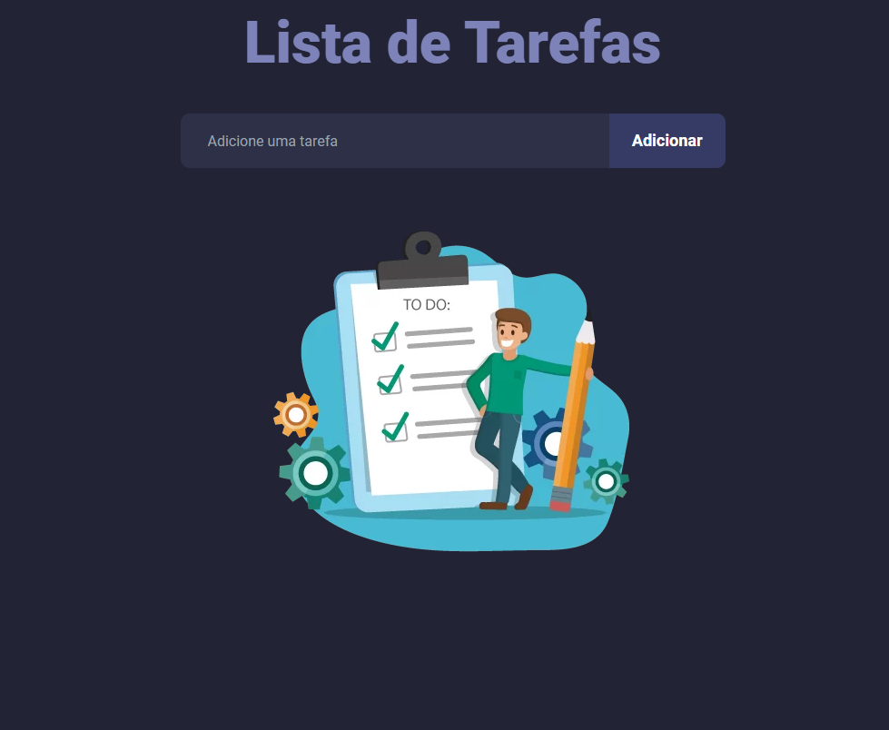

<div align="center">
  <h1>Lista de tarefas</h1>
  <p>Aplicação desenvolvida utilizando a API do GitHub, para realizar busca de usuários, utilizando a lib axios para requisições e respostas.</p>
  
</div>

# 📒 Índice
* [Descrição](#descrição)
* [Requisitos Funcionais](#requisitos)
  * [Features](#features)
* [Tecnologias](#tecnologias)
* [Design](#design)
  * [Cores](#cores)
  * [Fontes](#fontes)
* [Instalação](#instalação)
* [Licença](#licença)

# 📃 <span id="descrição">Descrição</span>
Lista de tarefas é uma aplicação simples para cadastro de tarefas, que alem de exibi-las e possível marcar como concluída e a possibilidade de excluir uma a uma ou todas de uma vez, desenvolvido em React para fim de estudos. Os estudos se propõe a entender o funcionamento de componentes, seu ciclo de vida, estados, componentização. Utiliza-se o [**Vite**](https://vitejs.dev/) como servidor de desenvolvimento e localStorage para persistência dos dados.

# 📌 <span id="requisitos">Requisitos Funcionais</span>
- [x] Cadastro de tarefa<br>
- [x] Exibição de tarefas<br>
- [x] Concluir tarefas<br>
- [x] Deletar tarefas<br>

## Features
- [x] Salvar localmente<br>
- [x] Deletar todas as tarefas<br>
- [x] Responsividade<br>

# 💻 <span id="tecnologias">Tecnologias</span>
- **HTML**
- **CSS**
- **JavaScript**
- **ReactJS**
- **Vite**

# 🎨 <span id="design">Design</span>
- O modelo final para versão desktop e mobile está disponível na pasta `./design`

- <span id="cores">Cores<br></span>
  * #222435<br>
  * #7d83b9<br>
  * #2d3046<br>
  * #fff<br>
  * #363b65<br>
  * #363f88<br>
  * #151627<br>
  * #1e1f2e<br>
  * #4d506e<br>
  * #ff004c<br>

- <span id="fontes">Fontes<br></span>
  * Roboto, sans-serif

# 🚀 <span id="instalação">Instalação</span>
```bash
  # Clone este repositório:
  $ git clone https://github.com/CleilsonAndrade/lista_tarefas.git
  $ cd ./lista_tarefas

  # Instalar as dependências:
  $ yarn install

  # Executar:
  $ yarn dev
```

# 📝 <span id="licença">Licença</span>
Esse projeto está sob a licença MIT. Veja o arquivo [LICENSE](LICENSE) para mais detalhes.

---

<p align="center">
  Feito com 💜 by CleilsonAndrade
</p>